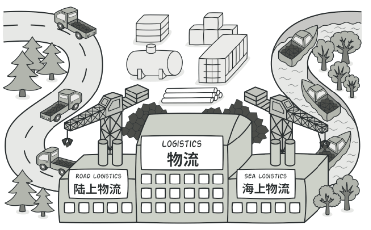

# 工厂方法模式

## 工厂方法模式介绍

工厂模式又称为工厂方法模式，是一个创建型设计模式，其在父类中提供一个创建对象的方法，允许子类决定实例化对象的类型。

它的主要意图是定一个创建对象的接口，让其子类决定实例化哪一个工厂类，工厂模式使其创建过程延迟到子类执行。

简单说就是为了提供代码结构的扩展性，屏蔽每一个功能类中的具体实现逻辑。让外部可以更加简洁的只是调用即可，同时也是去掉众多的`if else` 的方式。当然也有一些缺点，比如需要实现的类非常多，如何维护，怎样减低开发成本，这些问题可以结合其他设计模式来解决。

## 场景模拟

这里模拟互联网中在营销场景下的业务，在营销场景下经常会有一些让用户做一些操作（打卡，分享，留言等），进行返利积分，最后积分兑换商品，从而促活拉新。

这里我们模拟机会兑换中的发放多种类型的商品。现在我们有如下三种类型的商品接口

| 序号 | 类型               | 接口                                                         |
| :--: | ------------------ | ------------------------------------------------------------ |
|  1   | 优惠券             | ``CouponResult sendCounpon(String uId,String couponNumber,String uuid)`` |
|  2   | 实物商品           | ``Boolean deliverGoods(DeliverReq req)``                     |
|  3   | 第三方爱奇艺兑换卡 | ``void grantToken(String bindMobilerNumber,String cardId)``  |

从以上接口来看有如下信息：

- 三个接口返回类型不同，有对象类型，布尔类型，void
- 入参不同，发放优惠券需要去重，兑换卡需要卡ID，实物商品需要发货地址
- 随着业务的发展商品类型的增多

## 总结

工厂方法并不复杂，总结出他的优点：

- 避免创建者与具体的产品逻辑耦合
- 满足单一职责，每个业务逻辑实现都在自己的类中完成
- 满足开闭原则，无需更改使用调用方就可以额在程序中引入新的产品类型

缺点是如果有非常多的奖品类型那么子类也会急速扩张。