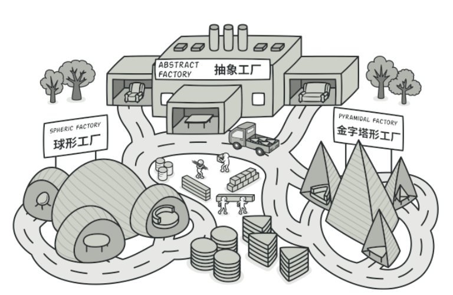
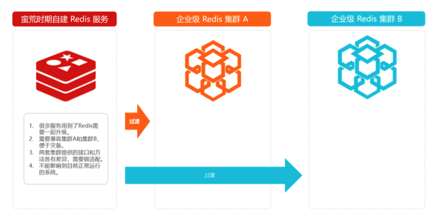

# 抽象工厂模式

## 抽象工厂模式介绍

抽象工厂模式与工厂模式虽然主要意图都是为了解决接口选择问题。但是在实现上，抽象工厂是一个中心工厂，创建其他工厂的模式。

在不同的操作系统内的回车换行

- Unix系统里，每行结尾只有<换行>，即\n

- Windows系统里，每行结尾是<换行><回车>，即\n\r

- Mac系统里，每行结尾是<回车>

我们业务中也时常有类似的问题，需要兼容做处理。但大部分经验不足的人直接ifelse进行处理了。

## 场景模拟

很多时候初期业务的蛮荒发展，也会牵动着研发对系统的建设。

业务初期使用单机版Redis，随着业务发展，需要更换更为健壮的Redis集群。虽然要修改但是不能影响目前系统运行，还要平滑过度过去。

可预见的问题会有：

- 很多服务用到Redis需要一起升级到集群
- 需要兼容集群A和集群B,便于后续的灾备
- 两套集群提供的接口和方法各有差异需要做适配
- 不能影响到目前的正常运行的系统

